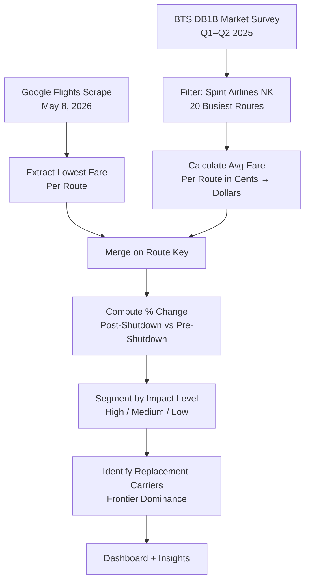
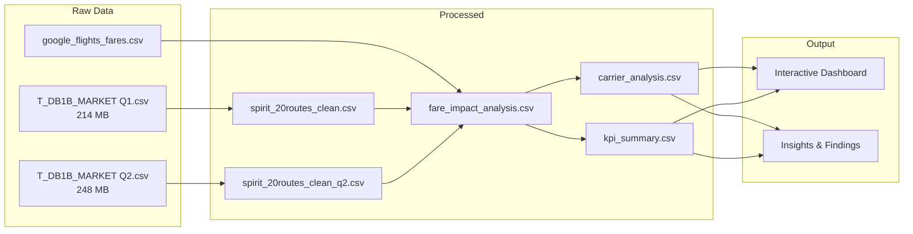

# ✈️ Spirit Airlines Shutdown: Fare Impact Analysis

> *When America's biggest ultra-low-cost carrier shuts down, who pays the price?*


---

## The Story

Spirit Airlines ceased operations on **May 2, 2026** — ending the run of the US's largest ultra-low-cost carrier. For millions of price-sensitive travelers on 20 key routes, the question was immediate: **how much would fares jump?**

This project answers that question with data.

---

## Key Findings at a Glance

| Metric | Value |
|--------|-------|
| Routes analyzed | 20 |
| Average fare change | **+7.5%** |
| Median fare change | **+12.4%** |
| Routes with 30%+ increase | **5 routes** |
| Hardest hit route | **DTW → MCO (+66.6%)** |
| Passengers affected (Q1–Q2 2025) | **121,806** |
| Primary replacement carrier | **Frontier (15/20 routes)** |

> **The nuance:** Frontier undercut Spirit on several leisure routes (ATL-FLL dropped **72%**), but corporate/connecting routes saw brutal increases of up to **+67%**.

---

## Dashboard

### Overview — KPIs, Fare Changes & Carrier Breakdown


*KPI cards · Before vs. After bar chart for all 20 routes · Carrier pie chart (Frontier 75%) · Fare impact tier breakdown*

### Counterfactual — What If JetBlue Had Merged With Spirit?


*Route-level table · 3-scenario comparison: Spirit baseline ($117) vs. JetBlue merger ($181, +54%) vs. Frontier actual ($127, +8%) · On 18/20 routes, Frontier ended up cheaper than JetBlue would have been*

> Open `dashboard.html` in any browser to explore interactively.

---

## Route-by-Route Impact

| Route | Spirit Fare (BTS Avg) | May 2026 Fare | Change | Impact |
|-------|----------------------|---------------|--------|--------|
| DTW → MCO | $130 | $217 | **+66.6%** 🔴 | High |
| LAS → IAH | $119 | $179 | **+50.2%** 🔴 | High |
| PHL → MCO | $107 | $153 | **+43.5%** 🔴 | High |
| BWI → FLL | $111 | $148 | **+32.9%** 🔴 | High |
| LAS → DFW | $111 | $146 | **+31.5%** 🔴 | High |
| FLL → LAX | $119 | $153 | +28.1% 🟡 | Medium |
| LAS → ATL | $129 | $164 | +27.0% 🟡 | Medium |
| FLL → DFW | $117 | $147 | +25.6% 🟡 | Medium |
| LAS → LAX | $68 | $84 | +23.3% 🟡 | Medium |
| DTW → FLL | $136 | $154 | +13.5% 🟢 | Low |
| MCO → ORD | $128 | $142 | +11.3% 🟢 | Low |
| MCO → BWI | $108 | $115 | +6.8% 🟢 | Low |
| ORD → FLL | $146 | $149 | +1.9% 🟢 | Low |
| FLL → ORD | $139 | $134 | -3.8% ⚪ | Decreased |
| MCO → LGA | $116 | $108 | -6.9% ⚪ | Decreased |
| IAH → MCO | $116 | $99 | -14.5% ⚪ | Decreased |
| FLL → LGA | $136 | $99 | -27.2% ⚪ | Decreased |
| FLL → ATL | $97 | $56 | -42.2% ⚪ | Decreased |
| IAH → FLL | $120 | $66 | -44.9% ⚪ | Decreased |
| ATL → FLL | $95 | $26 | **-72.6%** ⚪ | Decreased |

---

## Methodology



---

## Data Pipeline



---

## Project Structure

```
spirit-airlines-fare-impact/
├── data/
│   └── processed/
│       ├── spirit_20routes_clean.csv       # BTS Q1 2025 Spirit fares
│       ├── spirit_20routes_clean_q2.csv    # BTS Q2 2025 Spirit fares
│       ├── google_flights_fares.csv        # May 2026 live fares
│       ├── fare_impact_analysis.csv        # Route-level % change (main output)
│       ├── carrier_analysis.csv            # Post-Spirit carrier breakdown
│       └── kpi_summary.csv                 # Summary KPIs
├── notebooks/
│   ├── 03_analysis.ipynb                   # Main analysis (run this)
│   └── 03_analysis_executed.ipynb          # Pre-executed with outputs
├── dashboard.html                          # Interactive Plotly dashboard
├── requirements.txt
└── README.md
```

> **Note:** Raw BTS data (~460MB) is excluded from this repo. Download from [BTS DB1B](https://www.transtats.bts.gov/DatabaseInfo.asp?QO_VQ=EFD&DB_URL=).

---

## Setup & Run

```bash
# 1. Clone
git clone https://github.com/isha2605/spirit-airlines-fare-impact.git
cd spirit-airlines-fare-impact

# 2. Install dependencies
pip install -r requirements.txt

# 3. Run analysis notebook
jupyter notebook notebooks/03_analysis.ipynb

# 4. View dashboard
# Open dashboard.html in any browser — no server needed
```

---

## Tools & Stack

| Layer | Tool |
|-------|------|
| Data wrangling | pandas, numpy |
| Visualization | matplotlib, seaborn, Plotly |
| Notebook | Jupyter |
| Dashboard | HTML + Plotly.js |
| Data source | BTS DB1B Market Survey |

---

## Insights

1. **Frontier is the new Spirit** — it took over 15 of 20 routes but priced aggressively on leisure routes and higher on thin routes.
2. **Leisure routes got cheaper** — ATL-FLL, IAH-FLL dropped 40–70% as Frontier undercut even Spirit's old fares.
3. **Corporate/thin routes got crushed** — DTW-MCO, LAS-IAH, PHL-MCO all up 40–67% with no low-cost competition.
4. **121,806 passengers affected** — the fare shifts represent a real income transfer from consumers to airlines on high-impact routes.

---

*Data: Bureau of Transportation Statistics DB1B Market Survey (2025) + Google Flights (May 2026)*
